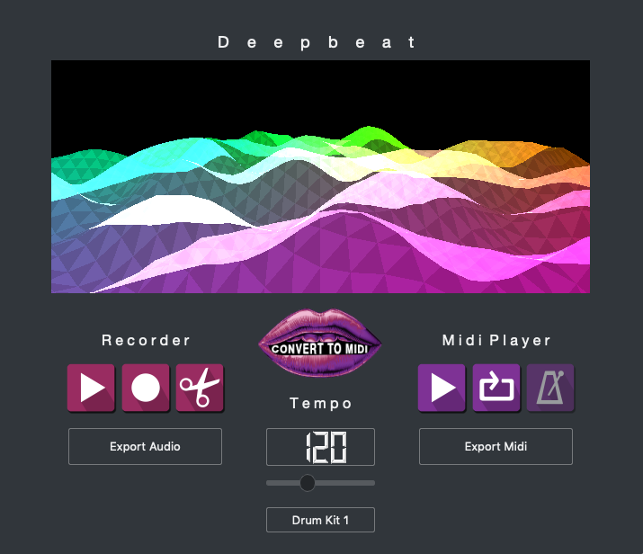

# Deepbeat-beatbox2midi
Deepbeat converts beatboxing to midi using a Convolutional neural network

# Deepbeat
##### Welcome to the Deepbeat repository!
Deepbeat is a crossplatform application used to convert beatboxing to midi drum information (Kick, Snare, Hihat) using a convolutional neural network trained on 1000s of beatboxing samples. 
It includes an audio recorder and trimmer for recording and slicing your beatboxes. The Midi section includes a convert to midi button, 4 drumkits for midi playback, a looper, tempo slider, and a metronome. Once your happy with your beat simply export the midi and use it in your favourite DAW.




##### Supported Platforms Builds:
- macOS (Mojave)
- Windows 10

## Running from the Terminal
Note this was build using python 3.6 so you'll need this version of python or one that is compatible with pyqt5. Also you'll need to pip install all the modules in requirements.txt.

```
cd /deepbeat-beatbox2midi
python Deepbeat.py
```
